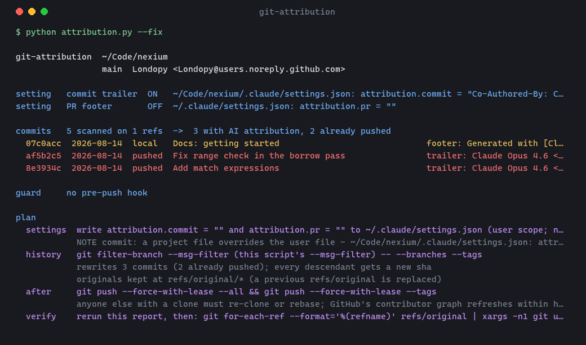

<div align="center">

# 🧹 git-attribution

**Claude Code showed up in your contributors. Find every commit it signed, get it out, and keep it out.**

[](https://github.com/Londopy/git-attribution/actions/workflows/ci.yml)
[](LICENSE)
[](https://www.python.org/)
[](skills/git-attribution/scripts/attribution.py)
[](https://code.claude.com/docs/en/plugins)
[](#install)



</div>

---

Claude Code appends `Co-Authored-By: Claude <noreply@anthropic.com>` to every commit it writes. GitHub reads that trailer and adds Claude to your repo's contributor graph. Nothing tells you it happened — you notice when the avatar shows up. Copilot, Codex, Cursor, Gemini, Devin and Aider do the same thing with their own names.

`git-attribution` answers the three questions that follow: **is it still being added?** (which settings file decided that), **where is it already?** (every commit on every branch, split into pushed and local-only), and **how do I get it out?** (a rewrite with a backup, and a pre-push hook so it doesn't come back). It runs as a skill (`/git-attribution`, or just say "Claude is in my contributors") and as a plain CLI.

## What it does

| Mode | Question it answers |
|---|---|
| default | Is the trailer **still being added** on this machine, and which of `settings.local.json` / `.claude/settings.json` / `~/.claude/settings.json` decided it? Which commits **already carry** attribution, and which of those are **pushed**? |
| `--prs` | Same scan over pull request bodies, via `gh`. |
| `--fix` | Show the plan: switch the setting off, rewrite the tainted commits, what to push afterwards. `--fix --apply` does the first two. **It never pushes.** |
| `--guard` | Show a `pre-push` hook that refuses commits carrying attribution. `--guard --apply` installs it. |
| `--agents claude` | Only look for one agent. Default: all seven it knows. |
| `--strict --no-settings` | Is this repo's history clean? Non-zero exit for CI. |

Everything is read-only except `--apply`, which shows you the plan first.

## Install

Pick whichever fits how you manage skills; all three produce the same result.

**`skills` CLI** (global; `--copy` because symlinks need Developer Mode on Windows):

```bash
npx skills add Londopy/git-attribution -g --copy
```

**Claude Code plugin** (in an interactive `claude` session):

```
/plugin marketplace add Londopy/git-attribution
/plugin install git-attribution@git-attribution
```

**By hand:**

```bash
git clone https://github.com/Londopy/git-attribution
cp -r git-attribution/skills/git-attribution ~/.claude/skills/
```

## Usage

### From Claude

Say what you'd naturally say — "is Claude still being added to my commits?", "Claude is in my contributors, get it out", "scrub the AI co-authors from this repo", "make sure that never gets pushed again" — or type `/git-attribution`. Claude runs the report, answers your actual question first, and before any rewrite confirms with you that the tree is clean and that you're willing to force-push if any tainted commit is already on the remote.

### As a CLI

Stdlib-only Python, nothing in it depends on Claude:

```bash
python ~/.claude/skills/git-attribution/scripts/attribution.py
python ~/.claude/skills/git-attribution/scripts/attribution.py --fix          # plan
python ~/.claude/skills/git-attribution/scripts/attribution.py --fix --apply  # do it
python ~/.claude/skills/git-attribution/scripts/attribution.py --guard --apply
```

| Flag | Effect |
|---|---|
| `--repo DIR` | Repository to inspect (default: cwd) |
| `--agents a,b` | Subset of `claude, copilot, codex, cursor, gemini, devin, aider` |
| `--prs` | Also scan PR bodies through `gh` (skipped if `gh` is missing) |
| `--fix` / `--fix --apply` | Plan / perform the settings change and the history rewrite |
| `--settings-only` / `--history-only` | Restrict `--fix` to one half |
| `--guard` / `--guard --apply` | Print / install the pre-push hook |
| `--strict` | Exit 1 if any tainted commit or PR is found |
| `--no-settings` | Skip the settings check (CI, or someone else's machine) |
| `--full` / `--json` | Untruncated commit list / machine-readable |

## What the rewrite does

`--fix --apply` runs `git filter-branch --msg-filter` over every branch and tag, with this script as the filter. Each message loses only its attribution lines (a `Co-Authored-By:` naming a known agent, a "Generated with …" footer, plus the blank line it leaves behind). Everything else in the message is untouched; a human co-author trailer stays.

- Commits older than the first tainted one keep their SHA. Everything after gets a new one — that's what a rewrite is.
- The originals are kept at `refs/original/*`. Your remotes are left alone (`git filter-repo` deletes them by design; that's why this uses `filter-branch`).
- It refuses to run on a dirty working tree.
- It does not push. If any rewritten commit was already on the remote, the plan prints `git push --force-with-lease --all && git push --force-with-lease --tags` for you to run, and reminds you that anyone else's clone needs a re-clone or rebase.
- GitHub rebuilds the contributor graph on its own schedule, usually within a few hours of the push. Claude will still show until then.

## The guard

`--guard --apply` writes `.git/hooks/pre-push` (or wherever `core.hooksPath` points). On every push it runs `git log --grep` over the commits about to go out and refuses the push if any of them still carry attribution, listing them. `git push --no-verify` overrides it once. It won't overwrite a pre-push hook it didn't write; `--guard` prints the text so you can merge it into yours.

This is a git hook, so it catches pushes from Claude Code, from your terminal, and from your IDE alike.

## What it catches

| Finding | Where | Why it matters |
|---|---|---|
| `attribution.commit` / `.pr` non-empty, or unset | settings precedence chain | New commits will keep getting the trailer. A project file silently overrides a user-level "off". |
| `includeCoAuthoredBy` | same | The older switch; still honoured, and removed when `--fix` writes the new key. |
| `commit.template` containing a trailer | git config | Every commit gets it, regardless of Claude. |
| `Co-Authored-By: <agent>` | commit message | The line GitHub turns into a contributor. |
| `Generated with …`, `Made with …` naming an agent | commit message / PR body | The PR footer; also ends up in squash-merge commit messages. |
| Agent as author or committer | commit metadata | Some setups commit *as* the agent. Not fixed by a message rewrite — shown so you know. |

## Related, not overlapping

`git log -i --grep=co-authored-by` finds the commits. This adds the pushed/local split, the settings precedence, the rewrite with a backup, and the hook. [`git filter-repo`](https://github.com/newren/git-filter-repo) is the better engine for a very large repo, but it needs a pip install and strips remotes on purpose; for a handful of commits, `filter-branch` shipping with git and keeping your remotes is the right trade.

## What it cannot do

- **It doesn't push, and it doesn't edit PR bodies.** Both are outward-facing; the plan prints the commands and URLs.
- **It can't override a managed policy file** or a project file you don't own. It tells you which file decided the setting.
- **It only knows the agents in `AGENTS`.** A trailer from a tool it hasn't heard of needs a name added to that dict — one line.
- **It can't make GitHub recompute contributors faster.** Only time does that.
